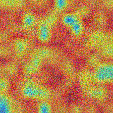

# What Does a Video World Model Actually Learn?



An interpretability deep-dive into **V-JEPA 2**: attention maps, temporal embedding drift, latent-space retrieval, and a small linear-probe evaluation.

## The question

V-JEPA 2 is trained to predict **masked video regions in latent space** (not pixels). That makes it powerful—and hard to reason about.

This repo asks: **what structure does a latent-prediction video model learn, and how can we make it visible?**

## Key findings

1. **Toy linear probe (4 classes × 10 clips):** a frozen V-JEPA representation reaches **75.0%** test accuracy; the pixel baseline reaches **87.5%** (variance is high at N=40; see limitations).  
2. **Latent-space retrieval is better than chance:** leave-one-out **Precision@1 = 0.65** on the same 4×10 toy library (chance is 0.25).  
3. **Attention maps produce stable spatial saliency:** last-layer token-0 attention concentrates on a small set of patches in dynamic shots, and is more diffuse in static shots (see `FINDINGS.md`).  

## Demo

Run the Gradio demo locally:

```bash
bash scripts/run_demo.sh
```

Tabs:
- **Attention Explorer** (per-frame attention overlays + optional rollout)
- **Temporal Drift** (frame-to-frame similarity and trajectory plots)
- **Nearest Neighbors** (requires a prebuilt reference index)
- **Masking Strategies** (tube vs random vs block masking visualization)

## What's in this repo

| File | Purpose |
|---|---|
| `src/model.py` | Load V-JEPA 2 encoder (HF primary) + preprocessing |
| `src/attention.py` | Attention extraction + attention rollout + overlays |
| `src/embeddings.py` | Temporal embedding drift + plotting helpers |
| `src/retrieval.py` | Latent-space nearest neighbors + index IO |
| `src/masking.py` | Mask generation + visualization |
| `src/probe.py` | Linear probe training + reporting |
| `demo/app.py` | 4-tab Gradio demo |
| `scripts/extract_features.py` | Batch feature extraction (offline) |
| `scripts/build_index.py` | Build reference index for retrieval tab |

## Reproducing the results

```bash
uv sync --extra torch

# (Optional) build a tiny public-domain 4×10 dataset
uv run python scripts/make_mini_dataset.py --out_dir data/mini_4x10

# Extract features + train a probe
uv run python scripts/extract_features.py --video_dir data/mini_4x10 --output data/features_mini.npz --classes bunny sintel tears dream --num_clips_per_class 10
uv run python src/probe.py --features data/features_mini.npz --pixel_baseline_dir data/mini_4x10 --out_dir outputs/probe_mini
```

## Limitations and honest caveats

- **The probe numbers in this repo are from a tiny, non-benchmark dataset** (4 Blender-film sources × 10 short clips). The point is pipeline + interpretability, not SOTA evaluation.
- **CPU-only inference is slow.** The demo is usable on CPU for short clips, but attention/embedding extraction is much better with a GPU.
- **Retrieval needs a reference library.** Build `data/reference_index.npz` (see `scripts/build_index.py`) before the retrieval tab can return results.

## References

- V-JEPA 2 (Meta): arXiv:2404.08471  
- Attention Rollout: Abnar & Zuidema, 2020  

